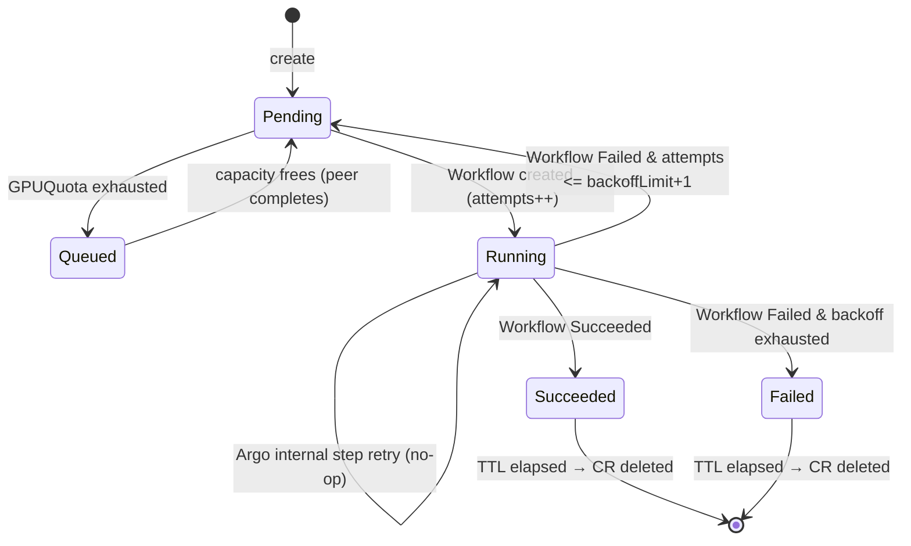

# Architecture

## Components

| Layer | Component | Role |
|---|---|---|
| Bootstrap | Terraform (`tehcyx/kind`) | Creates the kind cluster; installs Cilium + Argo CD; applies the root Application. Nothing else. |
| CNI | Cilium 1.19 | CNI + kube-proxy replacement (eBPF); `CiliumNetworkPolicy` enforcement; Hubble flow visibility. |
| GitOps | Argo CD 3.4 | App-of-apps; sync waves; self-heal. Owns every component except Cilium and itself. |
| Control plane | **ml-operator** (Kubebuilder/Go) | `TrainingJob` + `GPUQuota` CRDs; submits Argo Workflows; quota queueing; retry; TTL. |
| Pipeline | Argo Workflows 3.7 | `training-pipeline` WorkflowTemplate: train → evaluate → upload. |
| Storage | MinIO | In-cluster S3 for model artifacts (bucket `models`). |
| Serving | KServe 0.18 (Knative mode) + Kourier | Scale-to-zero model serving; custom PyTorch predictor. |
| Observability | kube-prometheus-stack + fake DCGM exporter | Metrics, 4 Grafana dashboards, simulated GPU fleet. |
| Report | `reports/cost-reliability` | Prometheus → projected GPU idle-cost reduction. |

## Bootstrap flow

```
terraform apply
  └─ kind cluster (disable_default_cni, kube_proxy_mode=none) → nodes NotReady
       └─ helm: Cilium            → nodes Ready
            └─ helm: Argo CD
                 └─ kubectl: platform-root Application (app-of-apps)
                      ├─ wave -1  namespaces + AppProject
                      ├─ wave  0  cert-manager
                      ├─ wave  1  kube-prometheus-stack   (CRDs needed early)
                      ├─ wave  2  MinIO · Knative + Kourier
                      ├─ wave  3  KServe · Argo Workflows
                      ├─ wave  4  fake-dcgm · dashboards · CiliumNetworkPolicies
                      ├─ wave  5  ml-operator
                      └─ wave  6  demo apps
```

Cilium and Argo CD **must** be Terraform's job: with `disable_default_cni`
nodes are NotReady and nothing — including Argo CD — can schedule until a CNI
exists. Argo CD cannot install its own runtime dependency. Everything else is
GitOps (ADR-0001).

## End-to-end data path

```
kubectl apply TrainingJob
  → operator quota gate (Queued if namespace GPUQuota exhausted)
  → operator submits Argo Workflow (workflowTemplateRef: training-pipeline)
  → train.py (PyTorch MNIST) → evaluate.py (gate on accuracy) → upload.py
  → model.pt + metrics.json in MinIO  s3://models/<ns>/<job>/
  → InferenceService pulls model via storage-initializer → serves
  → idle → Knative scales predictor to zero (GPU idle cost avoided)
  → fake DCGM exporter tracks simulated GPU assignment → Grafana → cost report
```

## TrainingJob state machine



### Retry-layer isolation (the subtle correctness rule)

Two independent retry layers must not interfere:

- **Argo per-step `retryStrategy`** — handles transient step failures *inside*
  a single Workflow run.
- **Operator `spec.retry.backoffLimit`** — re-submits a *whole new* Workflow
  when one terminates Failed.

`workflow_status.go` reacts **only to terminal Workflow phases** (`Succeeded`,
`Failed`, `Error`). Every non-terminal phase — including `Running` while Argo
retries an internal step — maps to `Running` and consumes nothing. The
operator increments `status.attempts` in **exactly one place**: when it
creates a new Workflow object. (Covered by `TestStepRetryChurnDoesNotConsumeAttempts`.)

## Parameter contract (operator ↔ pipeline)

The operator's `workflow_builder.go` and the `training-pipeline` WorkflowTemplate
must agree on these parameter names:

| Workflow param | Source (TrainingJob) | Default |
|---|---|---|
| `job-name` | `metadata.name` | — |
| `model` | `spec.model.name` | mnist-cnn |
| `dataset` | `spec.dataset.name` | mnist |
| `epochs` | `spec.hyperparameters.epochs` | "2" |
| `batch-size` | `spec.hyperparameters.batchSize` | "128" |
| `lr` | `spec.hyperparameters.learningRate` | "0.001" |
| `s3-path` | `<bucket>/<namespace>/<name>` | — |

`modelURI = s3://<s3-path>/`, which is exactly the InferenceService `STORAGE_URI`.

## Namespace & label contracts

- Workload namespaces (`training`, `models`, `minio`) labeled `fyp.io/workload=true`; default-deny applies.
- Pods needing the API server (operator, fake-dcgm, Argo executor) labeled `fyp.io/needs-api=true` (CCNP egress allow).
- The Argo train step pod labeled `gpu.fyp/simulated=true` → assigned a simulated GPU by the fake DCGM exporter.

## Image inventory

| Image | Built from | Used by |
|---|---|---|
| `ghcr.io/<owner>/fyp-ml-operator` | `operator/` | ml-operator Deployment |
| `ghcr.io/<owner>/fyp-trainer` | `training/` | Argo train/evaluate/upload steps |
| `ghcr.io/<owner>/fyp-mnist-server` | `serving/runtime/` | KServe predictor |
| `ghcr.io/<owner>/fyp-fake-dcgm-exporter` | `components/fake-dcgm-exporter/` | monitoring |
